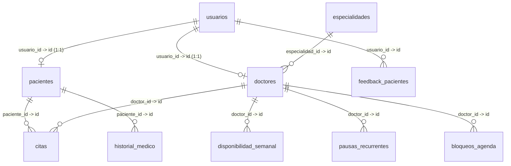

# Sistema de Gestión de Citas Médicas - AuraHealth

Una plataforma web integral diseñada para la programación y gestión de citas médicas, facilitando la interacción fluida y segura entre pacientes, personal médico y administradores.

---

## 📂 Estructura del Directorio de Código (`src/`)

El código fuente de la aplicación se organiza bajo el directorio `src/` siguiendo un diseño modular y estructurado por responsabilidades:

- **[`main.tsx`](file:///run/media/lubuntu/Disco%20Local/Downloads/SistemaDeCitasMedicas-Integrador2-main/src/main.tsx)** y **[`App.tsx`](file:///run/media/lubuntu/Disco%20Local/Downloads/SistemaDeCitasMedicas-Integrador2-main/src/App.tsx)**: Son los puntos de entrada principales de la aplicación. Configuran el enrutador de React (`react-router-dom`), los proveedores de contexto y definen las rutas públicas (`/login`, `/register`) y protegidas por roles con sus respectivos layouts y barras de navegación.
- **[`assets/`](file:///run/media/lubuntu/Disco%20Local/Downloads/SistemaDeCitasMedicas-Integrador2-main/src/assets)**: Carpeta dedicada a recursos estáticos del proyecto, tales como logotipos, imágenes e iconos personalizados.
- **[`components/`](file:///run/media/lubuntu/Disco%20Local/Downloads/SistemaDeCitasMedicas-Integrador2-main/src/components)**: Contiene componentes visuales reutilizables a nivel global.
  - `Navbar`: Barra de navegación superior común para usuarios autenticados.
  - `Sidebar`, `SidebarDoctor`, `SidebarAdmin`: Barras laterales específicas adaptadas con las opciones correspondientes para cada rol de usuario.
  - `ProtectedRoute`: Wrapper de seguridad que verifica si el usuario está autenticado y posee el rol adecuado para acceder a una ruta determinada.
- **[`context/`](file:///run/media/lubuntu/Disco%20Local/Downloads/SistemaDeCitasMedicas-Integrador2-main/src/context)**: Centraliza la gestión del estado global mediante la API Context de React:
  - **[`AuthContext.tsx`](file:///run/media/lubuntu/Disco%20Local/Downloads/SistemaDeCitasMedicas-Integrador2-main/src/context/AuthContext.tsx)**: Gestiona la sesión del usuario, persistiendo la información de autenticación y roles mediante `localStorage`.
  - **[`AppointmentContext.tsx`](file:///run/media/lubuntu/Disco%20Local/Downloads/SistemaDeCitasMedicas-Integrador2-main/src/context/AppointmentContext.tsx)**: Proporciona un estado global simplificado para operaciones locales de citas médicas.
- **[`layout/`](file:///run/media/lubuntu/Disco%20Local/Downloads/SistemaDeCitasMedicas-Integrador2-main/src/layout)**: Contenedores maestros de interfaz que estructuran el diseño general (Sidebars + Navbar + Contenido) en función del tipo de usuario.
- **[`lib/`](file:///run/media/lubuntu/Disco%20Local/Downloads/SistemaDeCitasMedicas-Integrador2-main/src/lib)**: Contiene la configuración de servicios y la comunicación directa con la base de datos (Supabase):
  - **[`supabase.ts`](file:///run/media/lubuntu/Disco%20Local/Downloads/SistemaDeCitasMedicas-Integrador2-main/src/lib/supabase.ts)**: Inicialización del cliente Supabase con variables de entorno.
  - **[`appointment-service.ts`](file:///run/media/lubuntu/Disco%20Local/Downloads/SistemaDeCitasMedicas-Integrador2-main/src/lib/appointment-service.ts)**: Servicio de programación de citas (búsqueda de especialidades, disponibilidad de doctores, registro, cancelación y reprogramación de citas con reglas de spam y validaciones horarias).
  - **[`availability-service.ts`](file:///run/media/lubuntu/Disco%20Local/Downloads/SistemaDeCitasMedicas-Integrador2-main/src/lib/availability-service.ts)**: Algoritmo para calcular dinámicamente los intervalos libres (slots) de un médico a partir de su horario laboral semanal, descansos programados y bloqueos de agenda.
  - **[`doctor-profile-service.ts`](file:///run/media/lubuntu/Disco%20Local/Downloads/SistemaDeCitasMedicas-Integrador2-main/src/lib/doctor-profile-service.ts)**: Consultas y actualizaciones del perfil médico, cambio de contraseña y subida de imágenes de avatar.
  - **[`doctor-service.ts`](file:///run/media/lubuntu/Disco%20Local/Downloads/SistemaDeCitasMedicas-Integrador2-main/src/lib/doctor-service.ts)**: Lógica administrativa para crear un nuevo usuario médico en Supabase Auth y registrar su perfil en la base de datos.
  - **[`medical-history-service.ts`](file:///run/media/lubuntu/Disco%20Local/Downloads/SistemaDeCitasMedicas-Integrador2-main/src/lib/medical-history-service.ts)**: Recupera las recetas y análisis clínicos asignados al historial del paciente.
  - **[`support-service.ts`](file:///run/media/lubuntu/Disco%20Local/Downloads/SistemaDeCitasMedicas-Integrador2-main/src/lib/support-service.ts)**: Permite enviar comentarios o sugerencias de forma anónima o autenticada al sistema.
- **[`pages/`](file:///run/media/lubuntu/Disco%20Local/Downloads/SistemaDeCitasMedicas-Integrador2-main/src/pages)**: Vistas principales del sistema, subdivididas por los diferentes accesos y roles:
  - `Login.tsx` / `Register.tsx`: Vistas para la autenticación y registro de pacientes.
  - `Patient/`: Reservas (`Schedule.tsx`), panel de citas activas (`Appointment.tsx`), visualización de historial clínico (`MedicHistory.tsx`), configuración de cuenta (`Config.tsx`) y soporte (`Suport.tsx`).
  - `Doctor/`: Gestión de agenda (`DoctorAvailability.tsx`), lista de citas asignadas (`AppointmentsCenter.tsx`), edición de datos (`DoctorProfileEdit.tsx`) y notificaciones (`NotificationsCenter.tsx`).
  - `Administrator/`: Dashboard con métricas globales (`Dashboard.tsx`), listado y eliminación de doctores (`AdminDoctors.tsx`), y formulario de registro médico (`AdminDoctorManager.tsx`).
- **[`types/`](file:///run/media/lubuntu/Disco%20Local/Downloads/SistemaDeCitasMedicas-Integrador2-main/src/types)**: Definiciones de interfaces y tipos de TypeScript (`types.ts`) para garantizar la robustez del código.

---

## 👥 Funcionalidades de la Aplicación por Rol

El sistema cuenta con tres roles principales de usuario, cada uno con un conjunto exclusivo de permisos y paneles de control:

### 🏥 1. Módulo del Paciente
- **Registro y Acceso**: Los pacientes pueden crear su propia cuenta libremente desde el portal de registro y acceder mediante su correo electrónico.
- **Programación de Citas**:
  - Filtrado interactivo por especialidad médica.
  - Selección de médico disponible.
  - Selección de fecha deseada con visualización en tiempo real únicamente de los horarios (slots de 30 minutos) que se encuentran libres.
  - Protección antispam que restringe reservar un máximo de 3 citas en menos de 2 minutos y evita agendar más de una cita en el mismo día.
- **Gestión de Citas**: Visualización de sus citas programadas pendientes de atención, con opciones para cancelarlas o reprogramarlas para una fecha u hora alternativa.
- **Historia Clínica Digital**: Visualización cronológica de sus recetas médicas, diagnósticos y resultados de análisis adjuntos por los médicos, incluyendo enlaces directos a sus correspondientes archivos PDF.
- **Configuración del Perfil**: Edición de datos personales (DNI, fecha de nacimiento, dirección, alergias), actualización de contraseña de acceso y carga de foto de perfil (avatar).
- **Centro de Soporte**: Envío de retroalimentación o reportes con calificación de estrellas sobre el funcionamiento de la aplicación.

### 👨‍⚕️ 2. Módulo del Doctor
- **Seguimiento de Citas**: Panel central donde el médico visualiza la lista de citas agendadas por los pacientes, organizadas por fecha y hora, permitiéndole dar seguimiento a sus consultas diarias.
- **Gestión de Disponibilidad**:
  - **Disponibilidad Semanal**: Configuración de los días de la semana y las horas en las que atiende consultas (admite rangos partidos, ej. mañana y tarde).
  - **Pausas Recurrentes**: Definición de horarios de descanso fijo (ej. hora de almuerzo) que se excluyen de la reserva de citas.
  - **Bloqueos de Agenda**: Declaración de periodos de inactividad (vacaciones, congresos, emergencias) definiendo un rango de fechas de inicio y fin para evitar que los pacientes programen citas en esos días.
- **Perfil Profesional**: Modificación de su biografía, teléfono, dirección de consultorio y carga de fotografía profesional.
- **Centro de Notificaciones**: Alertas y avisos oportunos sobre la actividad de sus citas médicas.

### ⚙️ 3. Módulo del Administrador
- **Dashboard de Control**:
  - Métricas en tiempo real sobre el número total de médicos activos, pacientes registrados, reportes de soporte recibidos y volumen de citas agendadas para el día actual.
  - Tabla interactiva con el historial de las últimas 5 citas médicas agendadas en todo el sistema.
- **Directorio de Doctores**: Buscador interactivo de personal médico con la posibilidad de activar/desactivar la disponibilidad de un doctor de forma inmediata o eliminar permanentemente su cuenta del sistema.
- **Registro de Médicos**: 
  - Formulario de alta para nuevos doctores que requiere nombre, apellido, DNI, teléfono, especialidad y biografía inicial.
  - **Generación Automática de Cuenta**: El sistema crea automáticamente una cuenta de usuario en Supabase Auth.
  - **Credenciales Institucionales**: Genera automáticamente un correo institucional (ej. `nombre.apellido@aurahealth.com`) y una contraseña aleatoria segura de 12 caracteres. El sistema muestra estas credenciales temporalmente en pantalla para que el administrador pueda copiarlas y proporcionárselas al nuevo médico.

---

## 🗄️ Estructura y Relaciones de la Base de Datos (Supabase)

La base de datos del proyecto está implementada sobre PostgreSQL en Supabase. A continuación se detallan las tablas que estructuran el sistema y sus relaciones lógicas:

### 📋 Descripción Detallada de las Tablas

#### 1. Tabla `usuarios`
Centraliza la información de autenticación y los accesos de la aplicación.
*   `id` (UUID, Primary Key): ID único generado y vinculado a la autenticación de Supabase.
*   `email` (Text): Dirección de correo electrónico del usuario.
*   `full_name` (Text): Nombre y apellido del usuario.
*   `user_role` (Text): Define el rol y permisos (`patient` | `doctor` | `admin`).
*   `is_active` (Boolean): Estado lógico de la cuenta del usuario.

#### 2. Tabla `pacientes`
Almacena la ficha técnica y datos clínicos del paciente.
*   `id` (UUID, Primary Key): ID único del paciente.
*   `usuario_id` (UUID, Foreign Key -> `usuarios.id`): Relación directa con su cuenta de acceso.
*   `dni` (Text): Documento Nacional de Identidad.
*   `fecha_nac` (Date): Fecha de nacimiento.
*   `direccion` (Text): Domicilio del paciente.
*   `alergias` (Text): Listado de alergias o condiciones preexistentes.
*   `foto_url` (Text): Dirección pública de su foto de perfil en el Storage.

#### 3. Tabla `doctores`
Detalles profesionales del equipo de médicos del sistema.
*   `id` (UUID, Primary Key): ID único del doctor.
*   `usuario_id` (UUID, Foreign Key -> `usuarios.id`): Relación con su cuenta de acceso.
*   `especialidad_id` (UUID, Foreign Key -> `especialidades.id`): Especialidad asignada al doctor.
*   `nombre` (Text): Nombre del médico.
*   `apellido` (Text): Apellido del médico.
*   `dni` (Text): Documento Nacional de Identidad.
*   `telefono` (Text): Teléfono de contacto.
*   `bio` (Text): Resumen profesional o biografía.
*   `is_available` (Boolean): Estado de disponibilidad general para recibir reservas de citas.
*   `foto_url` (Text): Dirección pública de su foto de perfil en el Storage.

#### 4. Tabla `especialidades`
Catálogo de áreas médicas en las que se divide el servicio.
*   `id` (UUID, Primary Key): ID de la especialidad.
*   `nombre` (Text): Nombre (ej. "Pediatría", "Cardiología", "Odontología").
*   `descripcion` (Text): Detalle de la especialidad médica.
*   `is_active` (Boolean): Estado activo de la especialidad para su selección.

#### 5. Tabla `citas`
Registra la reservación y estados de las consultas médicas.
*   `id` (UUID, Primary Key): ID único de la cita.
*   `paciente_id` (UUID, Foreign Key -> `pacientes.id`): Paciente que reservó la consulta.
*   `doctor_id` (UUID, Foreign Key -> `doctores.id`): Doctor asignado para la consulta.
*   `fecha_hora` (Timestamp): Fecha y hora programada de la cita.
*   `estado` (Text): Estado de la reserva (`pendiente` | `confirmada` | `cancelada`).
*   `reprogramada_de` (UUID, Foreign Key -> `citas.id`): ID de la cita original en caso de reprogramación.
*   `fecha_hora_original` (Timestamp): Fecha y hora previas a la reprogramación.
*   `created_at` (Timestamp): Fecha de creación del registro.

#### 6. Tabla `disponibilidad_semanal`
Define los turnos laborales estándar de cada médico.
*   `id` (UUID, Primary Key): ID único del turno.
*   `doctor_id` (UUID, Foreign Key -> `doctores.id`): Doctor al que aplica el horario.
*   `dia_semana` (Integer): Día laborable (1: Lunes, 2: Martes, ..., 7: Domingo).
*   `hora_inicio` (Time): Hora de inicio de atención (ej. `08:00`).
*   `hora_fin` (Time): Hora de fin de atención (ej. `13:00`).

#### 7. Tabla `pausas_recurrentes`
Horarios de descanso que se excluyen de la disponibilidad del turno de consulta.
*   `id` (UUID, Primary Key): ID de la pausa.
*   `doctor_id` (UUID, Foreign Key -> `doctores.id`): Doctor al que aplica el descanso.
*   `nombre` (Text): Concepto de la pausa (ej. "Almuerzo", "Reunión").
*   `hora_inicio` (Time): Hora de inicio de la pausa.
*   `hora_fin` (Time): Hora de fin de la pausa.

#### 8. Tabla `bloqueos_agenda`
Periodos extraordinarios en los que no habrá consultas de forma absoluta.
*   `id` (UUID, Primary Key): ID del bloqueo.
*   `doctor_id` (UUID, Foreign Key -> `doctores.id`): Doctor ausente.
*   `fecha_inicio` (Date): Fecha de inicio de la ausencia.
*   `fecha_fin` (Date): Fecha de fin de la ausencia.
*   `descripcion` (Text): Causa de la ausencia (ej. "Vacaciones", "Licencia Médica").

#### 9. Tabla `historial_medico`
Archivos e indicaciones clínicas pertenecientes al paciente.
*   `id` (UUID, Primary Key): ID de la entrada médica.
*   `paciente_id` (UUID, Foreign Key -> `pacientes.id`): Paciente dueño de la información.
*   `tipo` (Text): Categoría del documento (`consulta` | `receta` | `analisis`).
*   `titulo` (Text): Nombre del diagnóstico o tratamiento (ej. "Receta Amoxicilina").
*   `descripcion` (Text): Instrucciones, notas o resultados médicos.
*   `pdf_url` (Text): Dirección del documento digitalizado o reporte en formato PDF.
*   `created_at` (Timestamp): Fecha de registro de la entrada.

#### 10. Tabla `feedback_pacientes`
Retroalimentación voluntaria enviada por los pacientes sobre su experiencia.
*   `id` (UUID, Primary Key): ID del comentario.
*   `usuario_id` (UUID, Foreign Key -> `usuarios.id`, Nullable): Identificador del usuario emisor (admite anonimato).
*   `mensaje` (Text): Comentario escrito por el usuario.
*   `calificacion` (Integer): Calificación numérica otorgada (escala 1 a 5).

---

## 🗂️ Almacenamiento en la Nube (Buckets de Supabase Storage)

El sistema hace uso de dos buckets de almacenamiento para gestionar archivos estáticos cargados por los usuarios:
1.  **`pacientes_fotos`**: Almacena las imágenes de perfil de los pacientes. La estructura de guardado se organiza bajo la ruta `/patients/{usuario_id}.extension`.
2.  **`doctores-fotos`**: Almacena las fotos profesionales de los médicos. La estructura de guardado se organiza bajo la ruta `/doctors/{doctor_id}-{timestamp}.extension`.
